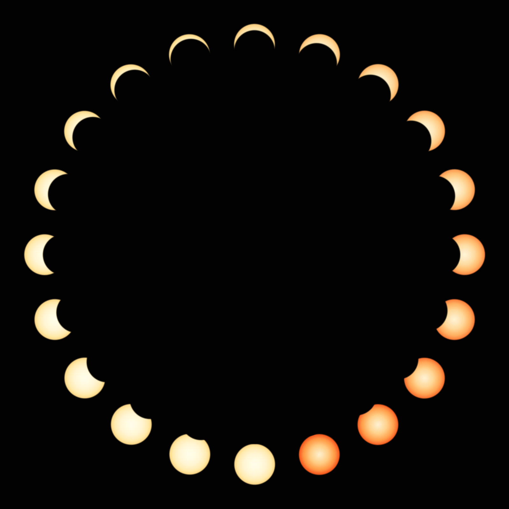

# Eclipse Circle Animation

Turns partial-solar-eclipse frames into a rotating "carousel": each frame is
placed on a ring (occluded side facing the center, crescent facing out) and the
sequence orbits the ring once per loop.



## Process

1. **Get frames** — synthetic: `generate_frames.py` renders 20 test frames
   (`eclipse_frames/`). Real footage: supply tracked shots with the sun centered.
2. **Measure moon positions** — real frames need `moon_positions.txt`
   (`<frame> <dx> <dy>`, direction from sun to moon). Use `measure_all.py` to
   detect the sun disk + crescent, then `select_frames.py` to pick evenly-spaced
   reliable frames and export the file. Synthetic frames use a built-in model.
3. **Build the ring** — `build_circle.sh` rotates each frame so its moon faces
   the center, arranges them on a black circle, and emits `N` animation frames.
4. **Encode** — `encode_animation.sh` produces an MP4 and looping GIF.

## Usage

```sh
python generate_frames.py          # optional: synthetic frames
python measure_all.py              # real footage: analyze all frames
python select_frames.py            # real footage: pick frames + moon_positions.txt
N=16 SRC_DIR=frames POSITIONS_FILE=moon_positions.txt ./build_circle.sh
./encode_animation.sh
```

Requires ImageMagick (`magick`) and `ffmpeg`.

## Input requirements

- **Format**: PNG (RGBA transparent is cleanest; opaque photos work but show the
  frame rectangle on the black canvas).
- **Naming**: sequential 1-based zero-padded (`01.png`, `02.png`, ...); change
  `SRC_PATTERN` if needed.
- **Size**: any; frames should be square with the sun centered (tracked shots).
  `R`/`SIZE` are in canvas pixels, not source-frame pixels.

## Parameters (environment variables)

| Variable | Default | Purpose |
|---|---|---|
| `N` | `20` | number of frames |
| `SRC_DIR` | `eclipse_frames` | input frame directory |
| `SRC_PATTERN` | `%02d.png` | input frame name pattern |
| `OUT_DIR` | `circle_frames` | animation frame output dir |
| `CIRCLE_OUT` | `eclipse_circle.png` | static ring image |
| `SIZE` | `1600` | square canvas side (px) |
| `R` | `660` | ring radius (px) |
| `POSITIONS_FILE` | `moon_positions.txt` | measured moon offsets |
| `S`/`B`/`MAX_FRAME` | `127.10`/`15.11`/`10` | synthetic model only |
| `FRAMES_DIR` | `circle_frames` | encoder input dir |
| `FRAME_PATTERN` | `%02d.png` | encoder frame name pattern |
| `FPS` | `10` | frames per second |
| `OUT_MP4`/`OUT_GIF` | `solar_eclipse_circle.mp4/.gif` | outputs |

### Examples

```sh
# 60 real photos named frame_001..060, bigger ring
N=60 SRC_DIR="eclipse_photos" SRC_PATTERN="frame_%03d.png" \
SIZE=2160 R=980 ./build_circle.sh

FPS=5 ./encode_animation.sh               # slower 2s loop
OUT_MP4=my.mp4 OUT_GIF=my.gif ./encode_animation.sh
```

## Loop notes

Animation frames step the starting phase one slot counter-clockwise per frame,
so `N` frames complete exactly one lap (frame `N` flows into frame `1`).
